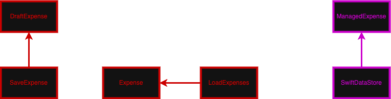

# Expense Manager Case Study

## Local Expense Tracking Feature Specs

### Story: User requests to view and log their expenses

### Narrative #1

```
As a user
I want the app to automatically load my previously logged expenses
So I can review my financial activity and track my spending
```

#### Scenarios (Acceptance criteria)

```
Given the local store has previously saved expenses
 When the user requests to see their expenses
 Then the app should display the saved expenses sorted by date

Given the local store is empty
 When the user requests to see their expenses
 Then the app should display an empty state message

Given there is a failure retrieving data from the local store
 When the user requests to see their expenses
 Then the app should display a retrieval error message
```

### Narrative #2

```
As a user
I want to log a new expense locally
So I can keep my financial records up to date
```

#### Scenarios (Acceptance criteria)

```
Given the user has provided valid expense details (amount, date, note)
 When the user requests to save the expense
 Then the app should successfully persist the expense to the local store
  And the app should refresh the view to include the newly added expense

Given the user has provided invalid expense details (e.g., negative amount)
 When the user requests to save the expense
 Then the app should reject the save request
  And the app should display a validation error message

Given there is a failure writing to the local store
 When the user requests to save the expense
 Then the app should display a saving error message
```

---

## Use Cases

### Load Expenses From Local Store Use Case

#### Primary course (happy path):
1. Execute `LoadExpenses` command.
2. System retrieves expense data from the local store.
3. System validates the retrieved data.
4. System maps local data into an array of `Expense` models.
5. System delivers the expense list.

#### Empty cache/store course:
1. System retrieves empty data from the local store.
2. System delivers an empty list.

#### Retrieval error course (sad path):
1. System catches a read/decoding error.
2. System delivers an error.

---

### Save Draft Expense To Local Store Use Case

#### Data:
- `DraftExpense` (amount, date, optional note)

#### Primary course (happy path):
1. Execute `SaveExpense` command with the above data.
2. System generates a new `UUID` for the expense.
3. System maps the `DraftExpense` and `UUID` into a complete `Expense` model.
4. System retrieves the current list of expenses from the local store.
5. System appends the new `Expense` to the list.
6. System encodes the updated list.
7. System overwrites the local store with the new data.
8. System delivers a success completion.

#### Saving error course (sad path):
1. System catches a write/encoding error.
2. System delivers an error.

---

## Flowchart


## Model Specs

### Expense

| Property | Type                |
| :------- | :------------------ |
| `id`     | `UUID`              |
| `amount` | `Double`            |
| `date`   | `Date`              |
| `note`   | `String` (optional) |

### Draft Expense

| Property | Type                |
| :------- | :------------------ |
| `amount` | `Double`            |
| `date`   | `Date`              |
| `note`   | `String` (optional) |

### Local Storage Contract

Since the app currently operates entirely locally, this represents the standard payload format saved to the device's local file system (e.g., via `Codable` to a JSON file).

```json
[
  {
    "id": "E621E1F8-C36C-495A-93FC-0C247A3E6E5F",
    "amount": 45.50,
    "date": "2023-10-25T14:30:00Z",
    "note": "Groceries at local market"
  },
  {
    "id": "123E4567-E89B-12D3-A456-426614174000",
    "amount": 12.00,
    "date": "2023-10-24T09:15:00Z"
  },
  {
    "id": "789E4567-E89B-12D3-A456-426614174000",
    "amount": 120.00,
    "date": "2023-10-23T18:45:00Z",
    "note": "Electric Bill"
  }
]
```

---

## App Architecture


